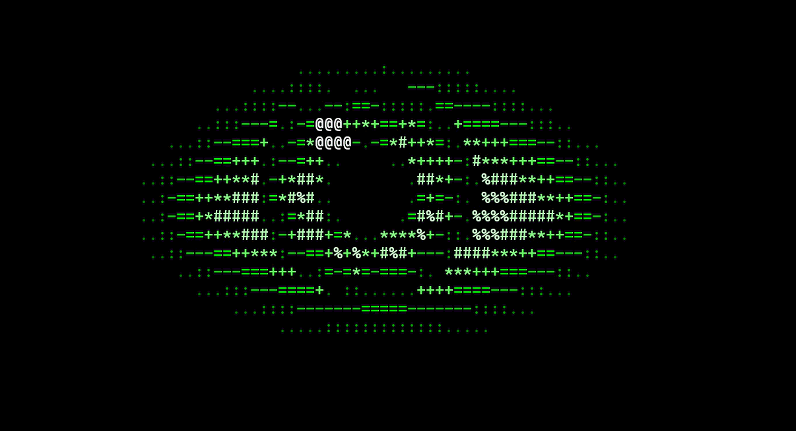

# Oculi

A realistic animated ASCII eye, written in C++ with no external libraries. It comes in two versions:

- **Terminal eye** (`eye.cpp`): the eye runs inside your terminal window.
- **Desktop assistant eye** (`eye_widget.cpp`, Windows only): a small floating eye that stays in the corner of your screen, on top of every window, follows your mouse and blinks.



## Features

- Moving iris with fine fibres, breathing pupil, glint and soft reflection
- Natural gaze and random blinks (sometimes a quick double blink)
- Grayscale mode and green "hacker" mode
- Clean exit, no dependencies

## Requirements

- A C++ compiler such as `g++` (MinGW on Windows, GCC or Clang on Linux/macOS)
- **Terminal eye:** a terminal with 256-color support (Windows 10 or newer, or any modern Linux/macOS terminal), at least **61 columns x 23 rows**
- **Desktop assistant eye:** Windows

## Download

```
git clone https://github.com/hasheramin5-cyber/Oculi.git
cd Oculi
```

Or click **Code > Download ZIP** on GitHub, extract it and open a terminal in that folder.

---

## 1. Terminal eye

### Build

```
g++ eye.cpp -o eye
```

### Run

| System | Command |
| --- | --- |
| Windows Command Prompt | `eye` or `eye green` |
| Windows PowerShell | `.\eye` or `.\eye green` |
| Linux / macOS | `./eye` or `./eye green` |

Add `green` for the green version. Press **Ctrl+C** to quit.

You only need to build once. After that, just run the program again.

---

## 2. Desktop assistant eye (Windows)

A small, borderless, transparent eye made of text characters. It sits in the bottom-right corner of your screen, stays on top of all windows, looks at your mouse pointer and blinks.

### Build

```
g++ eye_widget.cpp -o eye_widget -mwindows -lgdi32 -luser32
```

### Run

```
eye_widget
```

Or just double-click `eye_widget.exe`.

### Options

| Option | What it does |
| --- | --- |
| `gray` | Black and white eye instead of green |
| `box` | Adds a dark backing, helpful on bright windows |
| `3` to `8` | Size of the eye (3 is smallest, 4 is default) |

Options can be combined, for example:

```
eye_widget 3 gray box
```

### Controls

- **Drag** with the left mouse button to move it anywhere
- **Right-click** the eye to close it

### Close it from the command line

If right-click does not work:

```
taskkill /IM eye_widget.exe /F
```

### Start it automatically with Windows

1. Press **Win + R**, type `shell:startup` and press Enter.
2. Right-click in the folder, choose **New > Shortcut**.
3. For the location, enter the full path to `eye_widget.exe`, for example `C:\Users\User\Desktop\Oculi\eye_widget.exe`.
4. Name it `Oculi` and click **Finish**.

To stop it starting automatically, delete that shortcut from the same folder.

### Note

Closing or restarting your computer closes the eye. Start it again with `eye_widget.exe`, or use the startup shortcut above so it opens by itself.

---

## Troubleshooting

| Problem | Fix |
| --- | --- |
| `'g++' is not recognized` | Install MinGW (or another compiler) and add its `bin` folder to your `PATH`, then reopen the terminal. |
| `eye` is not recognized in PowerShell | Use `.\eye` instead of `eye`. |
| Terminal eye colors look wrong or garbled | Use Windows Terminal or the VS Code terminal, or update Windows. |
| Terminal eye is cut off | Make the terminal window bigger (at least 61x23) or reduce the font size. |
| `Permission denied` when building `eye_widget` | The old one is still running. Close it with `taskkill /IM eye_widget.exe /F`, then build again. |
| Desktop eye is hard to see on a bright window | Run `eye_widget box`. |
| Desktop eye is too big | Run `eye_widget 3`. |

## How it works

Every frame is calculated from math, not from stored images. Each cell of a character grid gets a brightness value, which is turned into a character (from `.` to `@`) and a color. The terminal version writes the frame with ANSI escape codes. The desktop version draws the same characters into a transparent, always-on-top window.

## License

This project is licensed under the [MIT License](LICENSE).
